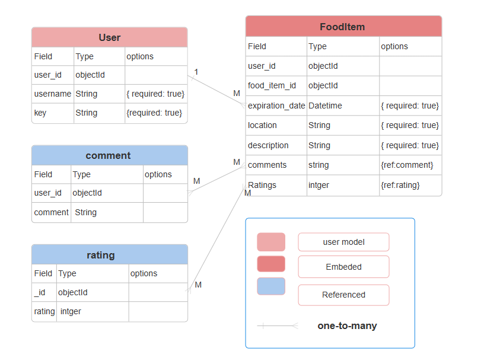

#  Food Sharing App
## Screenshot/Logo:

 

## Your app's name:
Food Sharing App
- https://food-sharing-project-d4d381d5ecad.herokuapp.com/

## Idea Description:
The Food Sharing App allows users to share surplus food items, Our mission is to reduce food waste while fostering community spirit. Whether you have extra food or you're looking for something to enjoy, this app makes it easy to share and find food before it expires. Join us in making a difference, one meal at a time!
 

## Getting Started
- [Deployed App Link](https://food-sharing-project-d4d381d5ecad.herokuapp.com/ 
)
- [Planning Materials](/plan/plan)
## ERD 
 

## Attributions: 
- **Images**: Icons and images sourced from [Freepik](https://www.freepik.com).
- **Fonts**: Fonts used in the app are from [Google Fonts](https://fonts.google.com).
## Technologies used: 
- Node.js
- Express.js
- MongoDB 
- EJS for templating
- CSS for styling
## Next steps: 
- Implement user notifications for new food shares to keep users updated on available items.
- Enhance the review system to allow users to upload images of food items, providing better context for reviews.
- Add an admin panel for moderating content and ensuring quality control.